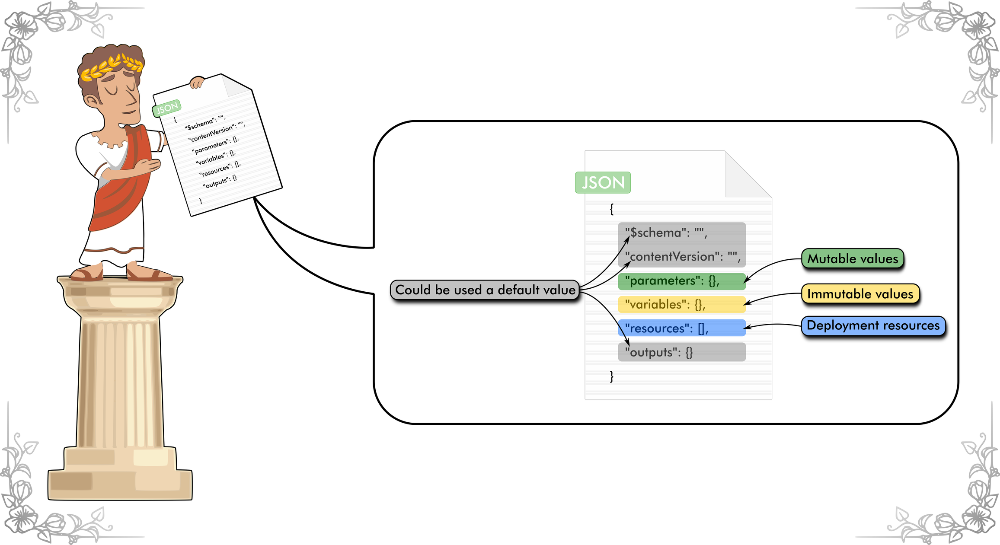

## How it started

---?color=linear-gradient(to left, #56ccf2, #2f80ed)
## Classic Azure

---
## Azure v 2.0

---

## ASM vs ARM

---
## Benefits:

@css[ fragment ](Resources)

@css[ fragment ](RBAC)

@css[ fragment ](IaaC)

---
## Resources

---

## ARM analogy to PC

---

## RBAC

---

## IaaC

---

## Toolkit

---

## Toolkit

---

## Toolkit

---

## Toolkit

---
