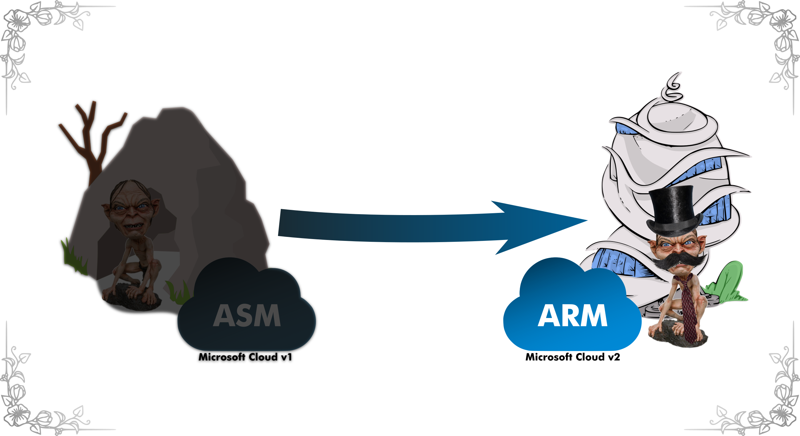
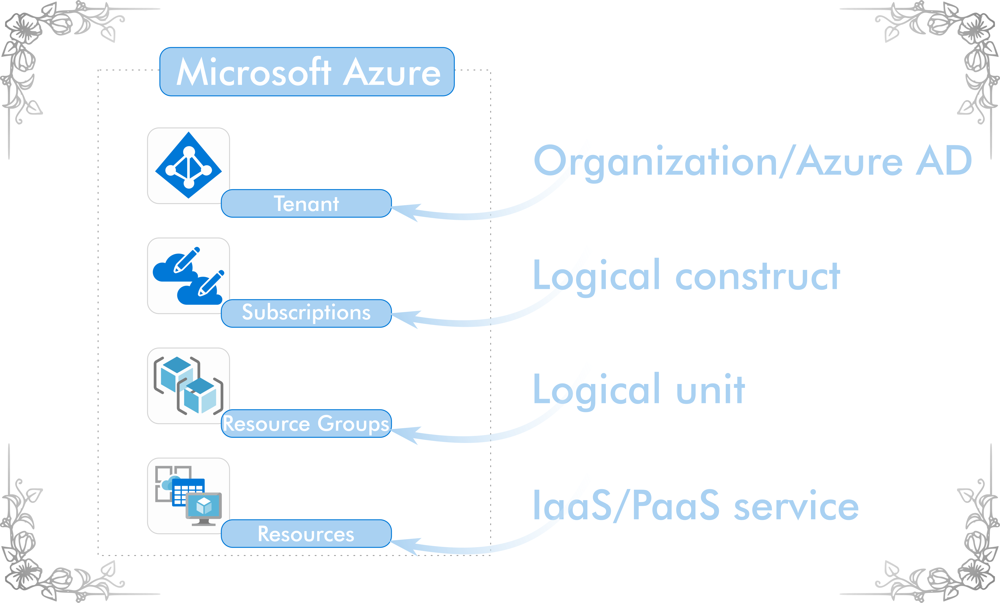
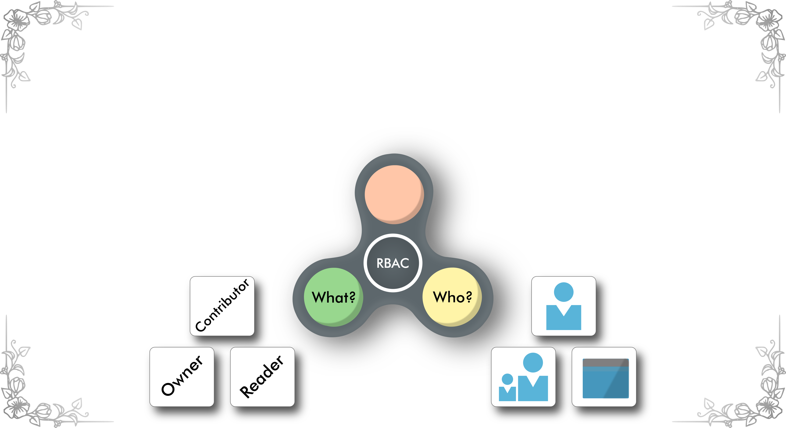
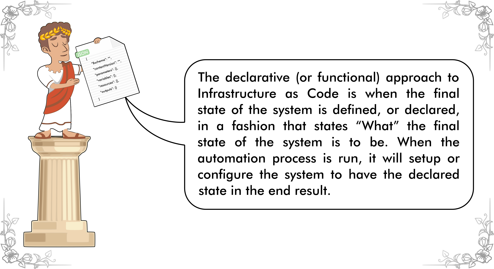
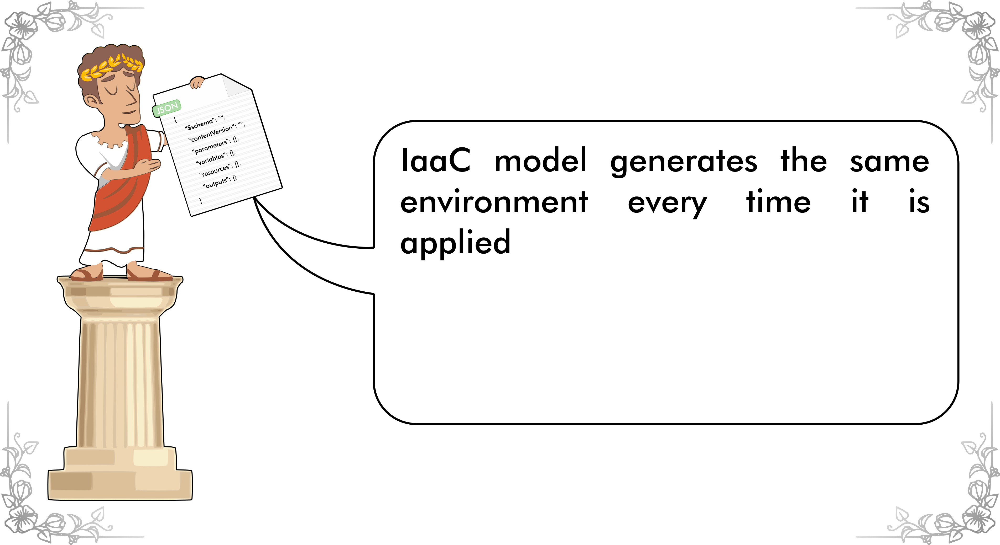
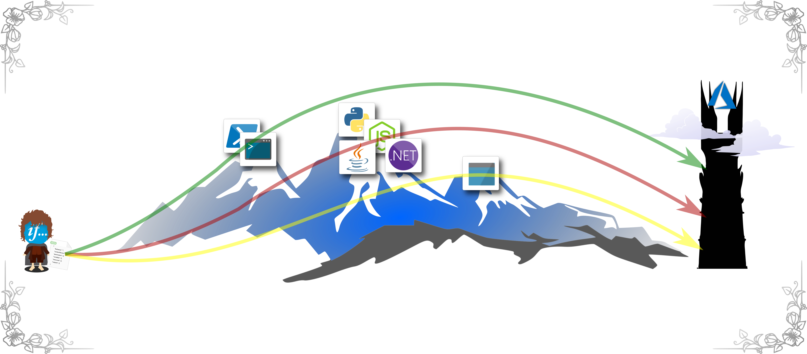

---

## Hackathon - How to provision your Azure ARM Template

Lasse Saine

Jurijs Fadejevs

A & P conference 26.3.2019
---
## Hackathon – really?

---
## Hackathon – really?

---
## Hackathon – really?

---
## Hackathon – really?

---
## Hackathon – really?

---

## Introduction

---

## Introduction

---

## ASM vs ARM

---

## ASM vs ARM

---

## ASM vs ARM

---
## Benefits:

@css[ fragment ](Resources)

@css[ fragment ](RBAC)

@css[ fragment ](IaaC)

---

## Resources

---

## Resources

---

## Resources

---

## Resources

---

## Resources

---

## Resources

---

## RBAC

---

## RBAC

---

## RBAC

---

## RBAC

---

## IaaC

---

## IaaC

---
## IaaC

---
## Toolkit

---

## Toolkit

---

## Toolkit

---

## Toolkit

---

## Toolkit

---

## Toolkit

---

## Any questions?
---

## Additional content
ifcloud.site

---

### Toolkit demo #1 – deploy ARM template with Azure portal GUI

Showcase by using only Azure portal GUI:
* Create XX resource manually
* Delete XX resource
* Create XX resource with ARM template
  * Pick your choice, toolkit is wide (PowerShell, Visual Studio Code etc.)
  * Easiest to get started: Azure portal, no ”extra” tools needed on your workstation, anybody can try

---
